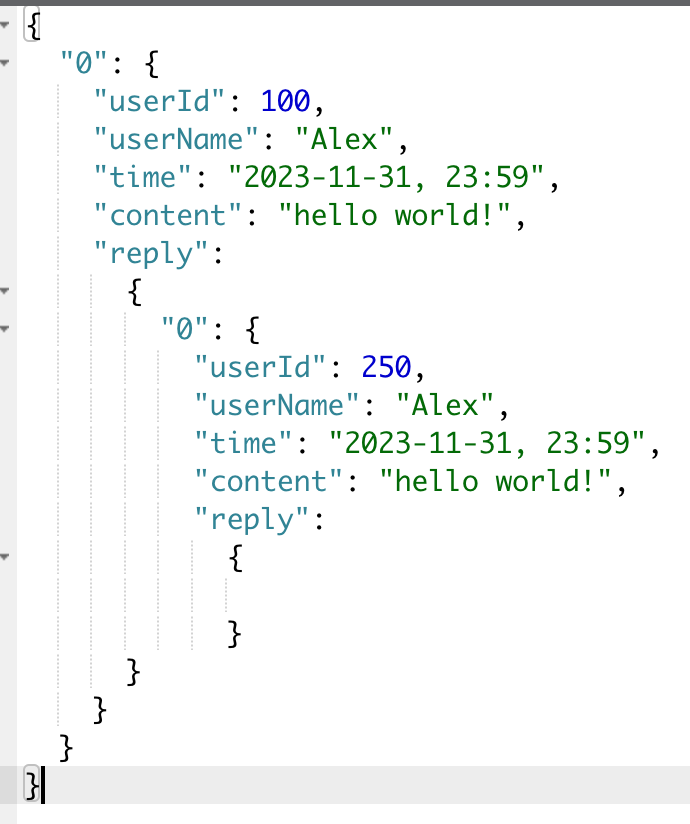

# API-MESSAGE

## 留言部分

> 留言规定如下格式：
- `placeId` (number): 留言的位置是在数据集页面(0)还是个人页面(1)还是模型页面(2)还是训练页面(3)
- `option` (string): 根据placeId，选择填入的内容
  - `datasetName` (string, 可选): 数据集的名称
  - `modelName` (string, 可选): 模型的名称
  - `personName` (string, 可选): 如果是在个人页面留言，被留言的用户的名字
  - `trainName` (string, 可选): 如果是在训练页面留言，被留言的任务名字
- `userId` (number): 留言用户ID
- `userName` (string): 留言用户名字
- `time` (string): 留言时间
- `content` (string): 留言内容
- `reply` (dict): 回复内容

### 获取留言信息 `GET api/messages/info`

**Request Body**

- `placeId` (number): 留言的位置是在数据集页面(0)还是个人页面(1)还是模型页面(2)还是训练页面(3)
- `datasetName` (string, 可选): 数据集的名称
- `modelName` (string, 可选): 模型的名称
- `personName` (string, 可选): 如果是在个人页面留言，被留言的用户的名字
- `trainName` (string, 可选): 如果是在训练页面留言，被留言的任务名字

**Response:**

- 成功 (`201`): 返回成功增加留言的信息

  - `messages` (dict): 如上格式的留言信息

- 失败 (`500`): 返回错误信息。

### 新增留言 `POST api/messages/create`

**Request Body**

- `placeId` (number): 留言的位置是在数据集页面(0)还是个人页面(1)还是模型页面(2)还是训练页面(3)
- `datasetName` (string, 可选): 数据集的名称
- `modelName` (string, 可选): 模型的名称
- `personName` (string, 可选): 如果是在个人页面留言，被留言的用户的名字
- `trainName` (string, 可选): 如果是在训练页面留言，被留言的任务名字
- `userId` (number): 用户ID
- `useraName` (string): 用户名称
- `time` (string): 留言时间
- `content` (string): 留言内容

**Response:**

- 成功 (`201`): 返回成功增加留言的信息。

  - `messages` (dict): 如上格式的留言信息

- 失败 (`500`): 返回错误信息。

### 新增留言回复 `POST api/messages/response`

**Request Body**

- `placeId` (number): 的位置是在数据集页面(0)还是个人页面(1)还是模型页面(2)还是训练页面(3)
- `datasetName` (string, 可选): 数据集的名称
- `modelName` (string, 可选): 模型的名称
- `personName` (string, 可选): 如果是在个人页面留言，被留言的用户的名字
- `trainName` (string, 可选): 如果是在训练页面留言，被留言的任务名字
- `messageId` ([number]): 被回复的留言序号（我们默认每个页面上的留言是顺序的，列表是因为回复可能嵌套）
- `userId` (number): 用户ID
- `useraName` (string): 用户名称
- `time` (string): 留言时间
- `content` (string): 留言内容

**Response:**

- 成功 (`201`): 返回成功上传条目后的数据集对象的信息：

  - `messages` (dict): 如上格式的留言信息

- 失败 (`500`): 返回错误信息。

